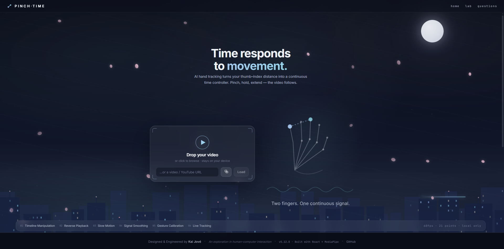
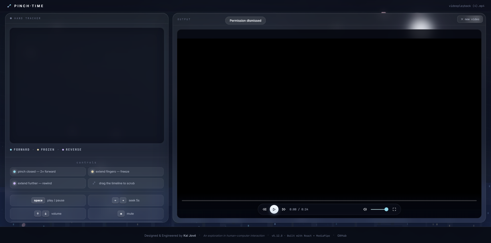

<div align="center">

# 🤏 PINCH·TIME

### Time doesn't live on a timeline anymore.

Control video playback using nothing but your hand.
Pinch to play. Open your fingers to slow down, freeze, or travel backwards in time.

<p>

<a href="https://pinchthetime.netlify.app">

</a>


</p>

</div>

---

# 📸 Preview

<td width="100%">
<td width="100%">
---

# 🌐 Live Demo

## 👉 https://pinchthetime.netlify.app/

Experience the interaction yourself directly in your browser.

No installation required.

---

# ✨ What is PINCH·TIME?

PINCH·TIME explores a different way of interacting with digital media.

Instead of dragging a timeline or pressing buttons, the distance between your thumb and index finger becomes a continuous timeline controller.

Your hand literally controls time.

The result feels somewhere between gesture interaction, cinematic editing and science-fiction interfaces.

---

# 🎬 Gesture Mapping

| Gesture | Action |
|----------|--------|
| 🤏 Fingers together | Normal playback |
| 👌 Slightly open | Slow motion |
| ✋ Half open | Freeze frame |
| 🖐 Fully open | Reverse playback |

Instead of jumping between fixed states, the transition is completely continuous.

---

# 🎥 Traditional Controls

Gesture interaction doesn't replace familiar controls—it enhances them.

✔ Play / Pause

✔ Timeline Scrubbing

✔ Drag to Seek

✔ Volume Slider

✔ Mute

✔ Fullscreen

✔ Keyboard Shortcuts

Everything works together seamlessly.

---

# ⚡ Highlights

### 🎯 Real-time Hand Tracking

Powered by MediaPipe Hand Landmarker.

Tracks hand landmarks at high frame rates with extremely low latency.

---

### ⏪ Continuous Reverse Playback

Not just a visual trick.

The playback engine actually reconstructs reverse motion frame-by-frame while synchronizing dedicated reverse audio.

---

### 🔊 Dynamic Audio Engine

The audio changes depending on playback direction.

Forward playback smoothly fades in.

Reverse playback activates a custom rewind audio buffer.

---

### 🎨 Cinematic Landing Experience

The homepage reacts to the visitor.

• Aurora animations

• Rain simulation

• Depth parallax

• Magnetic buttons

• Floating particles

• Interactive hero

• Cursor-driven effects

• Easter eggs

Everything is designed to feel alive.

---

# 🧠 Under the Hood

```
Camera
     │
     ▼
MediaPipe
     │
Hand Detection
     │
Pinch Distance
     │
One Euro Filter
     │
Velocity Mapping
     │
Scrub Engine
     │
Reverse Audio
     │
Video Playback
```

---

# 🛠 Tech Stack

| Frontend | AI | Media | Tooling |
|-----------|----|--------|----------|
| React | MediaPipe | HTML Video API | Vite |
| TypeScript | Hand Landmarker | Web Audio API | ESLint |
| CSS | | Fullscreen API | npm |

---

# 🚀 Run Locally

```bash
npm install

npm run dev
```

Open

```
http://localhost:5173
```

---

# 📈 Development Progress

- ✅ Project architecture
- ✅ Camera service
- ✅ Hand tracking
- ✅ Landmark overlay
- ✅ Pinch detection
- ✅ One Euro filter
- ✅ Velocity mapping
- ✅ Reverse playback engine
- ✅ Reverse audio engine
- ✅ UI redesign
- ✅ Landing page
- ✅ Gesture HUD
- ✅ Mouse controls
- ✅ Fullscreen mode
- ✅ Interactive hero
- ✅ Animations
- ✅ Performance polish

---

# 🎮 Keyboard Shortcuts

| Key | Action |
|:---:|--------|
| ␣ Space | Play / Pause |
| ← | Rewind 15 seconds |
| → | Skip forward 15 seconds |
| M | Mute / Unmute |
| F | Toggle Fullscreen |
| Esc | Exit Fullscreen |

---

# ⚙ Configuration

All interaction tuning lives in

```
src/config/interaction.ts
```

including

- pinch calibration
- smoothing
- velocity curves
- dead zones
- hysteresis
- reverse thresholds
- audio behavior

---

# 💡 Why this project?

Most video players ask users to adapt to the interface.

PINCH·TIME asks the interface to adapt to the user.

It's an experiment exploring whether gestures can become a more natural way of controlling time itself.

---

<div align="center">

### ⭐ If you enjoyed the project, consider giving it a star.

Made with ❤️ using React, TypeScript and MediaPipe.

</div>
